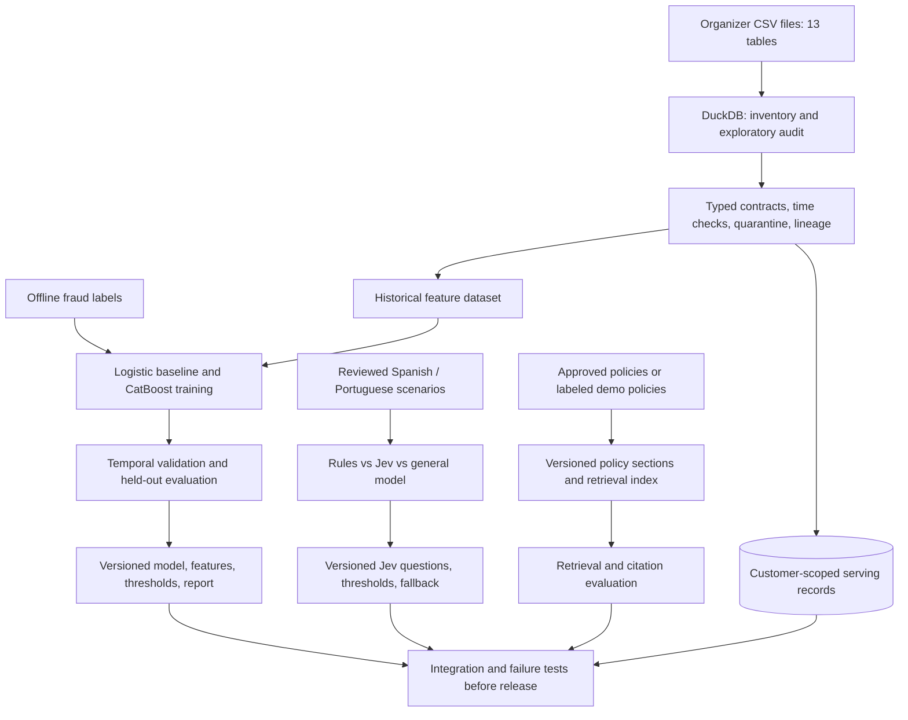
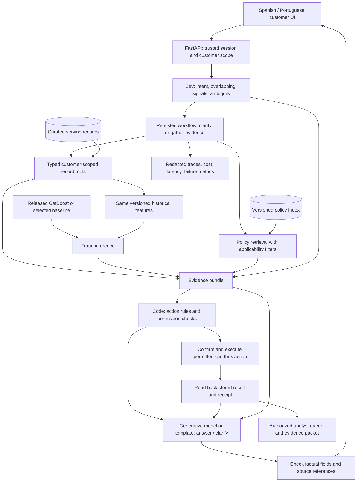

# Transaction support, fraud triage, and dispute intake

Design proposal, reviewed September 27, 2026. The raw inventory and exploratory data audits are complete; serving validation remains to be built. The models and product described here are not implemented or benchmarked. This expands the initial inquiry-only recommendation after inspecting the actual fraud fields and current Jev documentation. Model choices remain candidates until evaluated.

## Product and business objective

Help a Spanish- or Portuguese-speaking customer understand a transaction, report an unrecognized charge or suspected scam, and reach a verified resolution or useful human handoff. An analyst sees the transaction evidence, the customer's assertions, missing information, risk signals, and recorded actions separately.

Optimize correct, authorized resolution and time to a complete case, while measuring missed escalations, unnecessary reviews, and cost. Historical fraud amount is not money our prototype prevented; an offline model cannot establish production loss reduction.

Three meanings of fraud require different controls:

| Problem | Component | What its output means |
| --- | --- | --- |
| The customer reports an unauthorized payment, scam, pressure, or credential disclosure | Jev semantic judgments | Evidence about what the customer says, not proof of fraud |
| A transaction resembles historically labeled fraud | Calibrated tabular risk model | Estimated transaction risk under a specified evaluation setting |
| Someone tries to manipulate the assistant, cross customer boundaries, or execute unauthorized actions | Authentication, authorization, tool contracts, security tests; semantic flags as supplemental signals | Whether the service permits a particular action |

These outputs must remain distinct. A low transaction-risk score cannot dismiss a customer's report. A high Jev confidence cannot grant permission or establish liability.

## Integrated architecture: preparation, training, and release

The system has an offline preparation/evaluation path and an online customer-service path. The fraud model is trained offline and loaded for inference; it is not retrained during a chat. Jev and the generative model are pretrained providers. RAG retrieves current applicable policy text; it does not train either model.

Fraud labels live in the offline evaluation dataset, not in runtime tool projections. The same versioned feature definitions must be used in training and serving, with each history window ending before its decision timestamp. The initial feature experiment uses transaction history; digital-event features are a later ablation after timing and linkage checks.

The candidate temporal split was counted directly from the downloaded transaction table:

| Partition | Period | Transactions | Fraud labels |
| --- | --- | ---: | ---: |
| Training | Before January 1, 2026 | 3,738,506 | 3,713 |
| Validation | January–February 2026 | 237,060 | 196 |
| Test | March 2026 through the available June snapshot | 449,442 | 407 |

These are verified partition counts, not model results. Freeze the split and label-availability assumptions before fitting. Tune features, prompts, thresholds, and calibration on training/development only; use a separate untouched scenario set for language comparison. A release manifest records dataset/feature hashes, model version, policy revision, Jev/generative-model versions, prompt versions, thresholds, metrics, and known limitations. A model that does not improve the selected baseline is not promoted merely because training completed.

Policy preparation preserves document owner, source, section, jurisdiction, product, effective dates, and revision. Start with metadata filters and exact/full-text retrieval for a small corpus; add multilingual embeddings and reranking only if retrieval evaluation justifies them. There is no supplied bank-policy corpus yet. Organizer instructions and data dictionaries must not be turned into customer-facing bank policies.

## Runtime architecture

Use a small React customer UI and analyst view, FastAPI, and Postgres for curated serving data, sessions, case state, idempotency keys, and audit events. DuckDB remains the offline audit/feature engine. Use the documented LangGraph persistence/interrupt facilities if workflow complexity warrants them; do not build a distributed multi-agent platform for this scope. Authorization belongs in the service/tool layer regardless of orchestration library. Nodes retried or resumed around an interrupt must tolerate repetition.

Retrieve amounts, ownership, currency, and status through exact typed tools, never arbitrary model-generated SQL. Retrieve policy text by version, jurisdiction, and applicability, with lexical/semantic retrieval only when there is an approved corpus to search. Supplied data dictionaries are not banking refund policies. A vector database is not required for a small policy corpus.

Use a generative model for contextual questions, policy-grounded explanations, and handoff wording. Use deterministic templates when sufficient. Validate model-produced fields; execute only allowlisted actions and verify every write. Jev can flag unsupported wording or contradictions, but exact amount/currency/source-reference checks remain code. Neither a generative model nor Jev verifies that a bank action actually happened.

The diagram shows dependencies, not a requirement to invoke every component on every turn. After identity and required transaction details are established, independent record/risk and policy tasks can run concurrently when needed. A balance lookup can use a template without policy retrieval or fraud inference. A missing transaction identity triggers clarification before transaction scoring. Each tool repeats permission checks; the initial session gate alone is insufficient. Analyst access requires its own role and case scope.

## Contracts between components

| Artifact | Minimum contract | Owner |
| --- | --- | --- |
| `IntentAssessment` | Intent, independent reported signals, uncertainty as provided by the primitive, missing information, model/prompt version | Jev adapter with schema validation |
| `TransactionEvidence` | Permitted record ID, amount/currency/status, ownership result, as-of time, source reference | Exact record tool |
| `RiskAssessment` | Estimated risk or unavailable, decision timestamp, feature/model version, applicability, observed feature values | Local inference module |
| `PolicyEvidence` | Source/section IDs, applicable text, effective dates, jurisdiction/product, revision | Retrieval module |
| `ActionDecision` | Permitted action, required fields, confirmation state, code-policy version, reason for escalation | Deterministic workflow |
| `ActionReceipt` | Idempotency key, stored case/action ID, execution status, read-back verification | Sandbox case/action service |

Combine evidence through explicit rules, not an unexplained weighted average of Jev confidence and transaction risk. A customer's report can require a case even when risk is low. Retrieval text is evidence, not executable tool instructions. If a required source, model, or tool is unavailable, record that state and clarify or escalate; never silently substitute zero risk or an invented policy.

## Deployment, operations, and learning loop

The initial deployable unit is one FastAPI backend with modules for sessions, workflow, tools, Jev, fraud inference, retrieval, responses, and audit. A React app contains customer and analyst routes. Postgres stores curated records, policy metadata/text, sessions, cases, and audit events with separate access controls; a vector index is optional. Private artifact storage holds model/data manifests. DuckDB preparation and training run as separate local/batch jobs, outside the request server. Jev and the generative model are called through backend provider adapters; credentials are never sent to the browser.

Use bounded provider timeouts/retries and a per-conversation request/token budget. Writes use idempotency keys and read-back verification. Session state contains permitted structured context and source references; it is not an unrestricted cross-customer conversation memory. Monitor end-to-end outcome, required/missed escalation, retrieval coverage, data freshness, model-input missingness, latency, and cost. If fraud inference fails, continue supported service with risk marked unavailable and route according to policy.

Analyst corrections may enter a separate reviewed labeling queue with provenance and adjudication dates. They do not immediately retrain a model or modify prompts. A later candidate is evaluated and versioned before release, with rollback to the prior model/configuration. Because reviewed cases are a selected sample, feedback metrics must disclose selection bias. No recurring retraining automation or cloud infrastructure has been provisioned.

## What is built versus designed

| Component | Current evidence |
| --- | --- |
| Repo, environment, API scaffold, Docker, CI | Built and setup-tested |
| Raw dataset download, inventory, exploratory DuckDB audit | Executed across all 13 tables |
| Fraud-label audit and temporal partition counts | Measured; no trained detector yet |
| Typed curated serving data and authenticated tools | Designed; not implemented |
| Fraud training, calibration, artifact release, runtime inference | Designed; not run |
| Jev integration and reviewed bilingual benchmark | Designed; not run |
| Policy corpus and retrieval/RAG | Designed; suitable source documents still needed |
| Customer UI, analyst queue, verified case workflow | Designed; not implemented |
| Full-system evaluation and hosted demo | Planned; not performed |

## Jev's concrete role

Pin `jev-1.13.0` for the first candidate, recording prompt/schema/model versions and actual billed usage. Current docs list $0.042 per million input tokens, free output tokens, and text/JSON input. English is the primary training language and has the best reported accuracy; this makes separate Spanish and Portuguese evaluation essential. These are provider claims, not measurements on our workload. [Model documentation](https://docs.typesafe.ai/models).

| Judgment | Primitive | Proposed question |
| --- | --- | --- |
| Primary request | Choice | Payment status, unrecognized transaction, suspected scam, card issue, existing case, other/unclear |
| Unrecognized transaction report | Noul | Does the customer state they did not authorize or recognize this transaction? |
| Social engineering indicators | Separate Noul questions | Does the customer describe pressure, an impersonator, or sharing authentication information? |
| Desired human assistance | Noul | Is the customer asking to speak to a person? |
| Ambiguous reference | Choice or separate Noul | Does the provided context identify one transaction, several, or none? |
| Candidate relevance | Choice with none/ambiguous | Which already-authorized retrieved candidate matches the customer's description? |
| Language consistency / response support | Narrow judgments | Does the wording preserve the supplied meaning and stay within the provided evidence? |

Choice selects one option; overlapping conditions need independent questions. Batch independent questions against the same minimized state. Candidate selection can only see records already scoped to the session. Selecting a candidate does not authorize an action or replace confirmation when required. [Choice](https://docs.typesafe.ai/primitives/choice), [Noul](https://docs.typesafe.ai/primitives/noul), [intent routing](https://docs.typesafe.ai/patterns/intent-routing).

Keep absent evidence separate from a negative answer: if transaction identity or a required fact is unavailable, the workflow asks or marks it unknown. Choice/Score confidence measures concentration of the returned distribution; Noul returns a probability and no separate confidence. Tune routing thresholds on development cases, with error costs and abstention coverage reported. Do not copy documentation example thresholds into bank policy. [Confidence documentation](https://docs.typesafe.ai/confidence).

Compare Jev with keyword rules and a general-purpose multilingual model on identical, independently reviewed cases. Measure macro-F1, recall on scam/unauthorized-payment reports, false escalations, abstention, calibration, latency, and cost by language. Have a deterministic fallback on timeout, invalid output, or provider failure. Do not assume translation into English improves results; test that as a separate pipeline if needed, including translation errors and cost.

## What the downloaded fraud data actually establishes

Measured over all 4,425,008 transactions:

| Finding | Value | Consequence |
| --- | ---: | --- |
| `is_fraud=True` | 4,316 (0.09754%) | An always-negative predictor achieves 99.90246% accuracy; accuracy is misleading |
| Missing `fraud_score` | 885,157 (20.00%) | Missing score needs explicit treatment |
| Maximum supplied score among non-fraud rows | 30.0 | Strong synthetic-generation or target-leakage warning; provenance unknown |
| Supplied score >30, exploratory full-data diagnostic | 2,373 TP, 0 FP, 1,943 FN | 54.98% recall in this snapshot, not a held-out result or a new model |
| Missing merchant name | 3,395,774 (76.74%) | Merchant-specific features have limited coverage |
| Customers with at least one fraud-labeled transaction | 4,233 | Repeated fraud per customer is limited in this snapshot |

No label adjudication timestamp or supplied-score creation timestamp exists in the inspected transaction schema. The transaction schema also lacks recipient-account, device-ID, and digital-session keys. Digital events have customer/session/IP fields but no transaction ID. Thus a customer/time aggregation may be feasible after timestamp validation, while a specific session-to-payment connection or transfer-ring graph is not established.

The transcript corpus has only 42 distinct customer utterances across 171,321 rows, all containing `saldo`, and no Portuguese metadata coverage. Complaint-to-interaction links are absent. We do not have a demonstrated corpus of aligned, authentic dispute conversations paired with fraud outcomes. Customer-report classification requires separately labeled scenarios; never silently attach a customer's unrelated transcript to a fraud transaction.

Aggregate fraud diagnostics are saved locally in `artifacts/fraud-feasibility.json`. Reproduce the main counts with `docs/evidence/fraud-feasibility.sql` against `artifacts/data-profile.duckdb`. This supplementary analysis is separate from `make profile`.

## Transaction model and leakage controls

First define the decision time: support triage after a transaction is posted. A pre-authorization fraud detector is a different task and cannot use authorization status, response code, or later events. For either task, `is_fraud` is the target and must never be exposed in predictor input, model-visible tools, or explanation prompts during evaluation.

Candidate ladder:

1. Constant/rule baseline and the supplied score as a separately labeled diagnostic comparator, with its unknown provenance disclosed.
2. Logistic regression and CatBoost on legitimate available features; LightGBM is an alternative if a measured constraint justifies it.
3. A bounded tabular foundation-model challenger if it improves held-out quality at acceptable cost. Scale and sampling must be disclosed.
4. Temporal/graph features or Jev-derived text features only where valid relationships and labels exist. Add each in an ablation before retaining it.

Potential features: amount relative to the customer's prior amounts in the same currency; earlier transaction counts/velocity; channel/type; time; previously observed merchant/category/country; missingness indicators; and earlier digital activity aggregates if temporal linkage is defensible. An unfamiliar location or anomaly is not automatically fraud.

Exclude the supplied `fraud_score` from independent model features until its creation and availability are understood. Exclude post-incident outcomes and future customer/product snapshots. `products.last_updated` extends into 2027, so joining today's product balance onto an earlier transaction would not be a valid historical feature. Preserve event time and process date, and document known timestamp anomalies. A synthetic replay can define an assumed availability clock, but cannot claim proven production-time availability.

Split chronologically, select features/thresholds on training/development only, and preserve natural prevalence in the final evaluation. Define label-maturity assumptions because label timestamps are absent. Include an unseen-customer slice; historical scoring for returning customers can use their own prior events. Any downsampling/class weighting requires validation and calibration against a representative distribution. Report PR-AUC, recall at a fixed analyst review budget, precision, false-positive rate, calibration, and uncertainty. Monetary metrics need currency-consistent exposure and explicit cost assumptions.

Jev probabilities can become inputs to classical ML when aligned labeled text exists; TypeSafe demonstrates this pattern with CatBoost on wine reviews. That is evidence for an architecture pattern, not evidence that Jev improves this bank's fraud detection. The current disconnected transcripts do not support claiming that experiment works here. [Feature-discovery cookbook](https://docs.typesafe.ai/cookbooks/autoresearch_feature_discovery).

## Complete workflow and UI

1. Validate the trusted session. Retrieve only the permitted customer's records and show the historical as-of date.
2. Classify the request and overlapping signals. Ask a targeted question when a transaction or important fact is ambiguous.
3. Retrieve the identified transaction and bounded prior history. Compute risk using permitted features; keep customer allegations, model estimates, and verified facts separate.
4. Explain a supported transaction status or merchant record. Do not invent a decline reason, merchant alias, dispute deadline, or refund entitlement.
5. For an unrecognized charge or scam report, gather minimal case fields and prepare an evidence packet. Preserve urgency even when numerical risk is low.
6. Apply the documented action policy. Confirm any permitted state-changing sandbox action, use an idempotency key, then read back the stored result. Sandbox card-freeze requires an explicit mock contract and policy before implementation; it is not currently available.
7. Show the customer the verified case reference/status and next supported step. Show the analyst the timeline, allegations, evidence IDs, risk model/version, observed risk features, missing information, prior actions, and receipt.

Demo normal, ambiguous, and human-required paths in both languages. Include an unsuccessful write/read-back scenario; the assistant must not claim success. Explanations of model features describe associations, not causal proof or guilt.

## How the rest of the dataset fits

| Data | Useful role | Boundary |
| --- | --- | --- |
| Customers, products, transactions | Scoped evidence and transaction history | Current snapshots are not historical feature histories |
| Digital events | Prior activity features and app-friction context | No verified transaction-session linkage |
| Interactions, transcripts | Demand exploration and template audit | Metadata is not reliable intent ground truth |
| Complaints | Historical service taxonomy/context | Missing origin links; only five distinct descriptions in this snapshot |
| Service agents, branches | Handoff context where an explicit routing contract exists | No invented availability or skill assignments |
| Satisfaction surveys | Historical service analysis and hypotheses | Cannot measure our new assistant's CSAT |
| Exchange rates | Currency conversion after validating date/pair coverage | No mixed-currency totals or guessed rates |
| Campaigns and sends | Optional separate marketing analysis | Not needed in the fraud/dispute serving path; send-cost currency unspecified |

This accounts for all 13 tables without forcing every table into the customer workflow. Churn, sales, credit approval, and campaign optimization would require their own objectives and evaluation; they are not implied by this product.

## Current research and business evidence

- Stripe's payments foundation model uses representations learned from tens of billions of transactions. Its reported 59% to 97% detection improvement concerns a particular card-testing attack slice, not all fraud. This motivates temporal representations; it does not transfer Stripe's model, data advantages, or metrics to this dataset. [Stripe engineering/product account](https://stripe.com/blog/using-ai-optimize-payments-performance-payments-intelligence-suite).
- Nubank's KDD 2026 paper reports production customer-service systems built around structured context, calibrated evaluation, and measured online outcomes. Our inference is to invest in reliable tools and end-to-end evaluation alongside model selection. [Paper](https://arxiv.org/abs/2606.08867).
- A July 2026 PaySim preprint finds that graph/anomaly additions help particular subsets but do not improve overall average precision after removing a simulator shortcut; its investigation agent sometimes replaces correct predictions with plausible but wrong decisions. This is one dataset study, not a universal prohibition on graph models or agents. [Paper](https://arxiv.org/abs/2607.19266).
- A May 2026 preprint studies distilling tabular foundation models into CPU tree models and warns about teacher-label leakage. It supports testing a modern tabular challenger, not assuming a foundation model wins on this workload. [Paper](https://arxiv.org/abs/2605.18654).
- FraudBench studies adversarial manipulation of assistants, a separate evaluation dimension from transaction-label prediction. Test both legitimate service and attacks. [Benchmark](https://arxiv.org/abs/2608.18136).
- Workflow implementation references: [LangGraph persistence](https://docs.langchain.com/oss/python/langgraph/persistence) and [interrupts](https://docs.langchain.com/oss/python/langgraph/interrupts).

## Build order and acceptance

1. Freeze serving contracts and the labeling/split protocol; build the bilingual scenario corpus with provenance.
2. Build exact authorized tools, persisted cases, and the rule/template baseline.
3. Benchmark Jev and alternatives; implement clarification and outage fallback.
4. Run the fraud baseline ladder without the supplied-score shortcut. If signal fails to generalize, disclose it and retain customer-report triage; do not fabricate a successful detector.
5. Connect the customer and analyst views, verify case actions, and evaluate the complete workflow.
6. Run security/failure/language slices, measure cost/latency, host the sandbox, and prepare required submission artifacts.

Acceptance requires measured improvements with no hidden label access, authorized evidence, working bilingual paths, verified action receipts, and explicit limitations. Neither Jev inference nor fraud-model training has been run as part of this design review.
