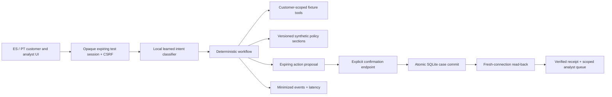

# Operating Claro

Claro is a single-process FastAPI prototype for **historical transaction support and sandbox dispute intake**, with an explicitly separate private organizer-data preparation/training workflow. It does not connect to a real bank or move money. The public customer records and bank policies are team-authored fixtures. The historical organizer snapshot is never copied into the public server image.

## Online architecture and ownership



Model output is advisory: it cannot choose identity, issue SQL, change permissions, approve a refund, or perform an action. Numeric facts are rendered directly from authorized records, preserving amount, currency, status, source and historical as-of date. Policy retrieval is an exact lookup over four versioned, explicitly synthetic sections; approximate retrieval or a vector database would add failure modes without improving this tiny corpus.

A confirmed customer report creates a review case even when the independent risk model is unavailable or out of domain. The evaluated fraud candidates failed promotion; the released organizer-domain prior is explicitly not personalized detection. Team fixtures receive `out_of_domain` with no probability. Fraud and language evidence are evaluated separately.

## Trusted test identity, isolation, and controls

The public persona selector is a **sandbox identity issuer**, not production customer authentication. It issues a random opaque, HttpOnly session cookie, stores only its SHA-256 hash, and binds it to a fixed fixture identity and role. Arbitrary customer IDs and role fields are rejected. Session TTL is one hour. A separate random workspace cookie allows a reviewer to switch between customer and analyst within their own demo workspace. Another browser has a distinct workspace and cannot inspect its cases, even with the analyst persona.

All state-changing authenticated endpoints require a session-bound CSRF header. Origin and cross-site checks also apply; hosted cookies use Secure and SameSite Strict. There is no permissive CORS policy. API responses are non-cacheable and a restrictive CSP disallows inline scripts and third-party connections. Parameterized queries enforce workspace/customer filters. Customer sessions cannot resolve cases or access analyst analytics.

Case proposals expire in ten minutes and a new proposal cancels the previous pending proposal. A separate confirmation button calls the action endpoint; conversational “yes” is not a write. Idempotency keys reject changed payloads, duplicate confirmations return the same case, and a unique proposal constraint prevents duplicate case creation under concurrency. A committed case is read from a fresh database connection before a verified receipt is returned. If read-back fails, the service returns 503 and the same request can be retried without creating another case. Analyst resolutions are limited to `reviewed_closed` and `needs_information`; neither is a bank adjudication or refund.

## Reliability and capacity

The runtime makes **zero remote model requests**. Classification loads a versioned JSON artifact and runs locally. There is no request-time training. A language failure is exposed and cannot trigger an unconfirmed action. Readiness fails if the model cannot load; liveness checks process availability. Unknown/missing evidence leads to clarification, abstention or a human-review proposal. The backend returns a controlled 503 on SQLite errors rather than claiming success.

SQLite uses WAL, foreign keys, parameterized statements, a 3-second lock timeout, and short atomic write transactions. This deployment uses one worker/one replica. It does not claim horizontal write scalability. Sixty chat events per workspace per minute limit ordinary demo traffic; this is not comprehensive adversarial DDoS protection. A production release needs upstream rate limiting, quotas, a durable transactional database, connection pooling and measured load/capacity targets. The HTTP benchmark reports its actual local sequential workload, not a production SLA.

The browser preserves a failed mutation's idempotency key for explicit retry where applicable. Automatic retry of a write is unnecessary; the API contract permits bounded client retries using the same key. Never change the key after an uncertain case-write response. A public fault-injection endpoint is intentionally absent; verification failures and model outages are injected at the service seam in automated tests.

## Retention, logging, and deletion

Raw customer messages are not persisted. Cases use a minimal normalized report category, verified fixture facts, policy source IDs, open questions and risk applicability. Audit events record a random trace ID, state, intent, language, tool event and timing, without message text or customer identifiers. Idempotency responses contain only the already scoped result. Uvicorn access logging is disabled in the image; application traces have no hidden chain-of-thought.

Workspaces and dependent sessions/proposals/cases/events are removed after 24 hours by cleanup on new session creation. Requests are also purged after 24 hours. This is opportunistic cleanup, not a precise scheduled erasure guarantee; an inactive service may retain expired rows until the next login. Session access expires independently. `DELETE /api/workspace` with CSRF removes the current sandbox workspace and its records; signing out revokes the current session while preserving the workspace for analyst review. A production deployment requires scheduled deletion, backups/retention policy, audit access control and legal review.

## Reproduction and rollback

```bash
make setup
make check
make dev                     # http://127.0.0.1:8000
make evaluate                # local whole-system comparison; no paid APIs
make pipeline                # requires private organizer audit database
make train-fraud             # offline CPU training; preserves holdout prevalence
make docker                  # no raw data or private artifacts in build context
```

`CLARO_DB` controls the SQLite location. `CLARO_SECURE=1` is required behind HTTPS. Optionally set `CLARO_ORIGIN` to the exact public origin; otherwise same-origin checks use the request host. Do not put credentials into browser code. The `.env.example` contains no secrets. Docker runs as an unprivileged user with a writable `/state` directory. For local durable testing, mount a volume at `/state`; hosted free-tier filesystem persistence must be disclosed independently.

Rollback means deploy the prior reviewed Git commit/image, retaining a compatible database volume where available. Model and policy artifacts are versioned in Git. An analyst correction never changes the model online; future changes require fresh development selection and a new untouched holdout. The current authored holdout can subsequently be used as regression data, not repeatedly claimed as blind evidence.

## Work required before real banking use

Replace public test personas with bank-managed identity, MFA and real customer/employee entitlements. Establish approved banking policies, real tool adapters, encryption/key management, durable storage, disaster recovery, privacy/retention controls, jurisdiction review, operational staffing, independent language/label validation, adversarial testing and monitored rollout. Obtain representative real-demand validation; the supplied corpus is synthetic and its dialogue labels are unsuitable as dispute ground truth. No offline result proves a production reduction in cost, fraud or customer harm.

## Official implementation references

- [FastAPI cookies](https://fastapi.tiangolo.com/advanced/response-cookies/)
- [Python SQLite transactions and parameter binding](https://docs.python.org/3.12/library/sqlite3.html)
- [Render free-service limits](https://render.com/docs/free)
- [Render FastAPI deployment](https://render.com/docs/deploy-fastapi)
