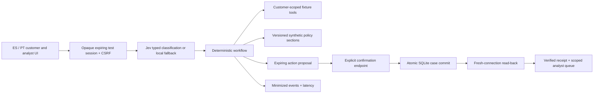

# Operating Claro

Claro is a single-process FastAPI prototype for **historical transaction support and sandbox dispute intake**, with an explicitly separate private organizer-data preparation/training workflow. It does not connect to a real bank or move money. The public customer records and bank policies are team-authored fixtures. The historical organizer snapshot is never copied into the public server image.

## Online architecture and ownership



Model output is advisory: it cannot choose identity, issue SQL, change permissions, approve a refund, or perform an action. DeepSeek Flash may supply a schema-validated conversational acknowledgement and clarification. The original deterministic response remains verbatim, generated supplements cannot carry financial numbers or action promises, and invalid output falls back visibly. Provider output does not update cases, permissions or policy. Numeric facts are rendered directly from authorized records, preserving amount, currency, status, source and historical as-of date. Policy retrieval is an exact lookup over four versioned, explicitly synthetic sections; approximate retrieval or a vector database would add failure modes without improving this tiny corpus.

A confirmed customer report creates a review case even when the independent risk model is unavailable or out of domain. The evaluated fraud candidates failed promotion; the released organizer-domain prior is explicitly not personalized detection. Team fixtures receive `out_of_domain` with no probability. Fraud and language evidence are evaluated separately.

## Trusted test identity, isolation, and controls

The current UI opens a customer session automatically and provides a separate reviewer route at `/?review=1`. The service remains a **trusted sandbox identity issuer**, not production customer authentication. It issues a random opaque, HttpOnly session cookie, stores only its SHA-256 hash, and binds it to a fixed fixture identity and role. Arbitrary customer IDs and role fields are rejected. Automatic ES/PT routing changes conversational language, not customer identity or permission. Session TTL is one hour. A separate random workspace cookie lets the same browser enter the reviewer workspace and return to the customer chat. Another browser has a distinct workspace and cannot inspect its cases, even with an analyst test session.

Customer and reviewer roles have separate cookies and persisted sessions. Opening either route preserves the other role's context, pending proposal and retry identity. A same-persona login refreshes that session without replacing its token or CSRF credential. `X-Claro-Role` selects the role cookie only; the service validates the actual session role, workspace cookie and endpoint permission. Clients without the header continue using the most recently issued legacy `claro_session` alias. Signing out revokes only the selected role. Workspace deletion revokes both roles and removes their scoped records.

Conversational transaction references operate on validated, already authorized records. Exact details narrow the candidates; a unique match can supply context, while multiple/no matches require clarification. Ordinals and displayed option numbers refer only to the previously displayed candidate order. Polite affirmative choices can lead a reply with additional report details; that choice intent is distinct from a selection-only reply, whose words are omitted from the report. Multiple choices stay ambiguous, an explicitly retracted option is excluded, and indefinite duplicate-charge wording does not select a list position. Numeric choices intersect any supplied merchant, amount, currency or date instead of resetting those constraints. Unknown establishments require an explicit transaction/store construction; ordinary place, channel, month and currency words are descriptive context. This is record identification within a permitted scope, never identity authentication or action authorization.

A period or comma between digits belongs to the transaction amount, not a new numeric-choice clause. Portuguese amount replies such as `38.50`, `38,50` and `Foi a de 16,75.` resolve only the exact authorized record. Explicit numeric options still intersect amount/merchant/currency/date evidence; an invalid or contradicted choice does not fall back to an earlier record. Bare amount selections retain the original allegation without adding choice-only words, while meaningful follow-up details augment the bounded redacted report. The Portuguese public fixture uses USD because organizer BRL coverage is absent.

Explicit negative amount selection, such as `Não a de 38.50.`, cannot attach that record or reuse an earlier selection. Pure choice replies preserve the preceding factual/review task and original report before clarification; genuine new requests retain priority. A clear different affirmative amount/option still intersects the rejected amount; genuine authorization denial remains a report about the identified charge. Currency evidence preserves the unit with the amount: scoped ISO codes and bounded dollar/real/euro/peso aliases and amount-adjacent `R$`/`€` symbols narrow permitted records, contradictory units clarify, and generic pesos preserve the COP/ARS/MXN ambiguity. Currency words inside exact authorized merchant names or record IDs do not become monetary evidence. A bare `$` establishes no unit. Serving currencies, fixture amounts and identity remain unchanged; no exchange conversion occurs. Exact generated `CASE-` references, including twelve numeric characters, survive bounded history redaction; phone/card and secret controls remain redacted.

A factual-status question cannot erase an explicit first-person denial of the transaction. Shared bounded grammar handles negated pronouns, perfect auxiliaries and explicit self-identification; unresolved grammatical negation preserves a learned dispute. Affirmative transaction recognition with an unrelated negative clause remains factual. Ordinal references require affirmative selection grammar; temporal mentions and rejected choices cannot silently attach a record. Per-turn language detection distinguishes Spanish `no` from the Portuguese preposition `no`. These reported meanings never authorize a banking action.

All state-changing authenticated endpoints require a session-bound CSRF header. Origin and cross-site checks also apply; hosted cookies use Secure and SameSite Strict. There is no permissive CORS policy. API responses are non-cacheable and a restrictive CSP disallows inline scripts and third-party connections. Parameterized queries enforce workspace/customer filters. Customer sessions cannot resolve cases or access analyst analytics.

At app creation, the HTML entry template receives CSS, JavaScript and favicon URLs with SHA-256 versions derived from the actual asset bytes. Both `/` and `/static/index.html` serve that same HTML with a strong content ETag. HTML and static responses use `Cache-Control: no-cache`, including conditional 304 responses, so a returning browser revalidates its public assets and a changed asset gets a new URL. API responses retain `no-store`. Runtime files are not rewritten; each deployed app derives its own versions from its packaged files. The Render edge may weaken the public validator to `W/` while preserving its content digest; the release probe records that distinction and verifies exact HTML bytes plus conditional 304 on both entry paths.

A proposal shows the customer their redacted report and exact attached transaction before confirmation. The compact snapshot names its ID, merchant, amount/currency, recorded status, date/as-of and source. A general human-review request explicitly attaches no transaction. The original request and meaningful follow-up details survive transaction clarification in a bounded redacted report; selection-only replies do not replace the allegation. The report remains a customer allegation, separately from verified transaction facts. Case proposals expire in ten minutes and a new proposal cancels the previous pending proposal. A separate confirmation button calls the action endpoint; conversational “yes” is not a write. Idempotency keys reject changed payloads, duplicate confirmations return the same case, and a unique proposal constraint prevents duplicate case creation under concurrency. A committed case is read from a fresh database connection before a verified receipt is returned. If read-back fails, the service returns 503 and the same request can be retried without creating another case. Analyst resolutions are limited to `reviewed_closed` and `needs_information`; neither is a bank adjudication or refund. Requesting information requires a specific question. The owning customer can reply while that question is pending, returning the case to `open`. Creation, questions, replies and closure are recorded as append-only case events in the same transaction as the status update. Mutations require idempotency keys and a fresh event read-back; repeated requests cannot duplicate a reply or review. Closed cases reject further changes. Existing pre-upgrade cases explicitly report incomplete history instead of inventing past events.

## Reliability and capacity

With external AI disabled, classification loads the versioned local JSON artifact and responses are deterministic. With explicitly enabled and budgeted provider access, the server calls Jev for one-shot classification and DeepSeek Flash for constrained conversational wording. See [AI_PROVIDERS.md](AI_PROVIDERS.md) for live-verification status, models, privacy, timeout and budget boundaries. There is no request-time training. A language failure is exposed and cannot trigger an unconfirmed action. Readiness probes only the local fallback and storage, never a paid provider; provider configuration is reported separately. Readiness fails if the local fallback cannot load; liveness checks process availability. Unknown/missing evidence leads to clarification, abstention or a human-review proposal. The backend returns a controlled 503 on SQLite errors rather than claiming success.

SQLite uses WAL, foreign keys, parameterized statements, a 3-second lock timeout, and short atomic write transactions. This deployment uses one worker/one replica. It does not claim horizontal write scalability. Sixty chat events per workspace per minute limit ordinary demo traffic; this is not comprehensive adversarial DDoS protection. A production release needs upstream rate limiting, quotas, a durable transactional database, connection pooling and measured load/capacity targets. The HTTP benchmark reports its actual local sequential workload, not a production SLA.

The browser preserves a failed mutation's idempotency key for at most three explicit attempts, then requires read-back reconciliation. The provider adapter independently bounds request size, response size, timeouts and retry count. External calls run outside SQLite write transactions; a session revision prevents stale inference from committing after reset, logout or another conversation turn. Automatic retry of a write is unnecessary; the API contract permits bounded client retries using the same key. Never change the key after an uncertain case-write response. A public fault-injection endpoint is intentionally absent; verification failures and model outages are injected at the service seam in automated tests.

## Retention, logging, and deletion

Cases and pending conversation context retain the specific customer report after pattern-based secret/contact redaction, bounded in length. The current session also retains a short redacted conversation window for UI recovery: at most twelve recent messages, bounded to 12,000 characters, with user/assistant messages individually capped. Reset clears this window and pending proposals while retaining confirmed cases. Analyst questions and customer replies are similarly minimized and stored in the scoped case history. After a customer reply event passes fresh read-back, the final idempotency-response transaction appends the verified stored reply and localized acknowledgement to this same bounded session window. Cached retries append nothing; read-back or final transaction failures claim no success. The context revision invalidates stale concurrent chat. The client follows a validated ES/PT reply response language while the persisted case language and fixture identity stay unchanged. The service does not retain a full raw chat transcript. Redaction is defense in depth, not guaranteed anonymization; the UI prohibits real personal data. Cases separately carry verified fixture facts, policy source IDs, open questions and risk applicability. Audit events record a random trace ID, state, intent, language, tool event and timing, without message text or customer identifiers. Per-call provider metadata records model, prompt version, measured tokens, estimated tariff cost and unknown-cost attempts; invoices are not inferred from estimates. Idempotency responses contain only the already scoped result. Uvicorn access logging is disabled in the image; application traces have no hidden chain-of-thought.

Workspaces and dependent sessions/proposals/cases/events are removed after 24 hours by cleanup on new session creation. Requests are also purged after 24 hours. This is opportunistic cleanup, not a precise scheduled erasure guarantee; an inactive service may retain expired rows until the next login. Session access expires independently. `DELETE /api/workspace` with CSRF removes the current sandbox workspace and its records; signing out revokes the current session while preserving the workspace for analyst review. A production deployment requires scheduled deletion, backups/retention policy, audit access control and legal review.

The separate provider spending ledger retains reservations, token counts, cost estimates and the opaque workspace scope after conversation deletion or expiry. It stores no prompts, responses, credentials or customer identifiers. Retaining these accounting rows prevents erasure from resetting the shared spending cap; deleting that ledger is an explicit operator budget reset, not part of workspace erasure.

## Reproduction and rollback

```bash
make setup
make check
make dev                     # http://127.0.0.1:8000
make evaluate                # local whole-system comparison; no paid APIs
make pipeline                # requires private organizer audit database
make train-fraud             # offline CPU training; preserves holdout prevalence
make docker                  # no raw data or private artifacts in build context
```

`CLARO_DB` controls the SQLite location. `CLARO_SECURE=1` is required behind HTTPS. Optionally set `CLARO_ORIGIN` to the exact public origin; otherwise same-origin checks use the request host. Do not put credentials into browser code. The `.env.example` contains no secrets. Docker runs as an unprivileged user with a writable `/state` directory. For local durable testing, mount a volume at `/state`; hosted free-tier filesystem persistence must be disclosed independently.

Rollback means deploy the prior reviewed Git commit/image, retaining a compatible database volume where available. Model and policy artifacts are versioned in Git. An analyst correction never changes the model online; future changes require fresh development selection and a new untouched holdout. The current authored holdout can subsequently be used as regression data, not repeatedly claimed as blind evidence.

## Work required before real banking use

Replace public test personas with bank-managed identity, MFA and real customer/employee entitlements. Establish approved banking policies, real tool adapters, encryption/key management, durable storage, disaster recovery, privacy/retention controls, jurisdiction review, operational staffing, independent language/label validation, adversarial testing and monitored rollout. Obtain representative real-demand validation; the supplied corpus is synthetic and its dialogue labels are unsuitable as dispute ground truth. No offline result proves a production reduction in cost, fraud or customer harm.

## Official implementation references

- [FastAPI cookies](https://fastapi.tiangolo.com/advanced/response-cookies/)
- [Python SQLite transactions and parameter binding](https://docs.python.org/3.12/library/sqlite3.html)
- [Render free-service limits](https://render.com/docs/free)
- [Render FastAPI deployment](https://render.com/docs/deploy-fastapi)
