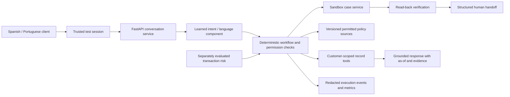

# Build and evaluation plan

This is a proposal, not implemented product behavior or measured results. Revisit workflow selection after label/record-linkage review.

## Recommended workflow: transaction support, fraud triage, and dispute intake

Build a bilingual service that explains an authenticated demo customer's transaction, identifies customer-reported scams and disputed charges, combines verified records with separately evaluated transaction-risk signals, and creates a verified sandbox case when human review is needed. Jev is the proposed semantic-classification candidate. Fraud prediction is a distinct tabular-model task. The complete design and research comparison are in [ARCHITECTURE.md](ARCHITECTURE.md); that document supersedes the original inquiry-only recommendation.

Three demo stories:

1. **Normal:** a Spanish-speaking customer asks about a specific payment. The service verifies the session, checks ownership, reads its currency and status, and returns an answer with record evidence and an as-of date. Portuguese performs the same workflow.
2. **Ambiguous:** “¿Ya salió?” / “Já saiu?” with multiple possible transactions. The system uses conversation context and asks a targeted question; it does not guess an amount or select an arbitrary account.
3. **Human-required:** “No reconozco ese cargo” / “Não reconheço essa cobrança.” The service gathers the minimal authorized context, creates a sandbox support case through a permitted tool, reads back the stored case, and gives a verified reference. It does not promise a refund or determine fraud.

No model/provider has passed a benchmark yet. Jev `jev-1.13.0` is the first semantic candidate; logistic regression and a gradient-boosted tree are transaction-risk candidates. The actual core customer/product/transaction joins passed the audit. Serving contracts still need to enforce them. The transcript corpus does not provide valid dispute-intent ground truth; use independently reviewed evaluation scenarios with explicit provenance.

## Proposed architecture

The [integrated architecture](ARCHITECTURE.md#integrated-architecture-preparation-training-and-release) defines the offline preparation/training path, model and Jev release artifacts, policy-index preparation, runtime contracts, deployment layout, and built-versus-designed status. The diagram below is only a workflow overview.

The model interprets language and drafts source-grounded wording. The service owns session identity, customer filtering, allowed actions, required fields, confirmation, idempotency, and state transitions. The model cannot choose a different customer identity or issue arbitrary SQL.

Keep one backend and one small UI initially. DuckDB handles offline data analysis/preparation. Use a separate transactional store for sessions/cases when implementing writes; the raw audit database is not an application database. RAG is useful for approved policy text, while structured records should be queried through deterministic tools. Do not add a vector database unless the retrieval workload needs one.

## Implementation milestones

| Milestone | Completion evidence |
| --- | --- |
| 1. Data and scope | File manifest, coverage/quality findings, workflow decision with evidence, reviewed labels |
| 2. Serving data | Explicit typed contracts; deterministic conflict/quarantine rules; currencies preserved; full lineage; no unsafe cross-customer joins |
| 3. Secure tools | Trusted test sessions, expiry, record ownership checks, allowed actions, idempotency, verified case read-back |
| 4. Baseline | Keyword/rule intent router and deterministic templates using the same tools and cases as the proposed system |
| 5. Learned components | Benchmark Jev semantic judgments and transaction-risk candidates separately; pinned versions; no target leakage; bounded failures |
| 6. Conversation/UI | Multi-turn clarification, Spanish and Portuguese, three required paths, useful human handoff |
| 7. Evaluation | Frozen held-out workload, baseline comparison, failures and language slices, latency/cost evidence |
| 8. Hosted demo and submission | Authenticated sandbox demo, public safe repository, 4–6 slides, short video, final checklist |

## Data preparation rules to implement

- Preserve raw data and hash it. Carry source file and pipeline version into curated outputs.
- Define the key/grain per table. Exact duplicates may be removed deterministically; conflicting rows must be quarantined or handled with a documented source/update policy. Never keep an arbitrary row.
- Keep event time and process/ingestion date separate. A later clock time on the same calendar day is not the same as a later event date. Audit timestamp anomalies without assuming a timezone correction.
- Treat `amount` with its `currency`; `amount_usd` is a separate representation. Do not sum MXN, COP, and ARS. Do not infer campaign-send currency.
- Report missingness/orphan rates with denominators. Exclude unsafe record links from serving.
- Show the snapshot's as-of date. A June 2026 historical dataset must not be represented as a customer's current September balance.
- Define batch refresh and atomic replacement, process late arrivals by a documented lookback, and test changed/deleted records with a labeled fixture. Streaming is optional.
- Inspect transcript/metadata agreement. Keywords and supplied topic fields are candidate weak labels, not independently validated ground truth.

## Evaluation design

Start with a label guide: intended workflow, required slots, permitted customer/records, expected action, expected final outcome, required clarification/escalation, and evidence IDs. Use valid hand-reviewed labels or relevance judgments. Separate organizer-supplied synthetic examples, team-generated scenarios, translations, and reviewed annotations in the manifest.

Use customer groups and transcript-template/semantic groups to prevent duplicated templates or translated siblings leaking across splits. Add a temporal holdout where meaningful. Choose splits and thresholds on development data, freeze the held-out set, and run both systems on the identical cases. Do not use final complaint resolutions or later transactions as features for earlier decisions.

For an initial stress suite, target at least 120 hand-reviewed scenarios, balanced between Spanish and Portuguese and covering normal, ambiguous, and human-required paths. This is a planning target, not an organizer minimum or a statistical sufficiency claim. Report natural-demand evaluation separately from deliberately oversampled security/failure cases. Native Portuguese review is preferable; mark unreviewed translations honestly.

Include expired sessions, other-customer references, forged tool instructions, prompt injection in retrieved text, missing values, inconsistent records, tool timeout/error, duplicate submission, failed write verification, contradictory requests, and mixed-language ambiguity. Repeat stochastic runs with recorded model/prompt versions and settings; disclose run-to-run variability.

| Metric | Definition / reporting rule |
| --- | --- |
| Safe automated resolution | Correct policy-compliant completion without a human / all in-scope test cases; also report attempted-automation share |
| Containment | No transfer / cases; do not equate containment with correctness |
| Unsafe outcomes | Unauthorized disclosure/action or materially wrong outcome; show counts and denominators |
| Escalation quality | Required transfers done correctly, useful context, missed transfers and unnecessary transfers |
| Component quality | Intent macro-F1, slot correctness, or retrieval relevance metrics appropriate to the selected component |
| Latency | End-to-end p50/p95 under a stated workload, including failure paths |
| Cost | Per attempted case and per successful automated resolution; undefined if zero successes; measured model usage and explicit infrastructure assumptions |
| Language/segment slices | Outcomes by language and authorized segments; sample sizes and disparity analysis |

Logs should retain tool names, permitted inputs, source IDs, policy decisions, action receipts, verification status, timestamps, and cost/latency. Hidden model chain-of-thought is not an audit artifact. Redact identifiers/content that are unnecessary and define retention/deletion rules before hosting.

Do not label historical `was_resolved` as the new system's accuracy. Do not claim offline simulations prove production savings. If using an LLM judge, publish the rubric and validate a sample against human or deterministic judgments. Confidence intervals and small-sample caveats matter even when no unsafe outcomes are observed.

## Working schedule from September 27

| Date | Focus |
| --- | --- |
| Sep 27 | Setup, full download, audit, source-backed requirements, provisional scope |
| Sep 28 | Confirm joins/labels and workflow; create serving contracts and frozen split plan |
| Sep 29 | Trusted sessions, authorized record tools, deterministic baseline |
| Sep 30 | Learned multilingual component, multi-turn state, handoff service |
| Oct 1 | Spanish/Portuguese UI and three demo stories; failure-path integration |
| Oct 2 | Held-out evaluation, language review, cost/latency and safety fixes |
| Oct 3 | Deploy sandbox, inspect real hosted behavior, rerun reproducible checks |
| Oct 4 | Freeze demo; produce 4–6 slides and video; review repository/data boundaries |
| Oct 5 | Submit before confirmed cutoff; allow time for access or upload problems |

Time is limited. If behind, reduce workflow breadth and UI polish while preserving bilingual behavior, record isolation, meaningful evaluation, and verified outcomes.
